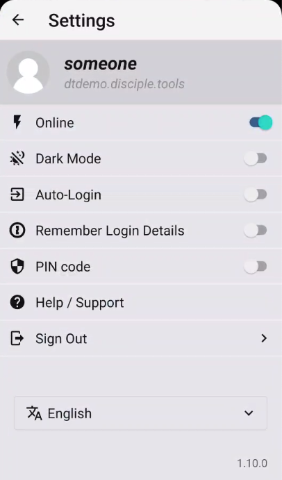
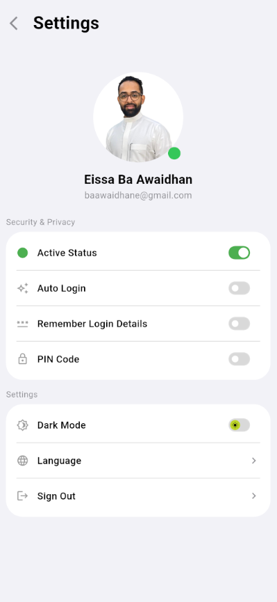
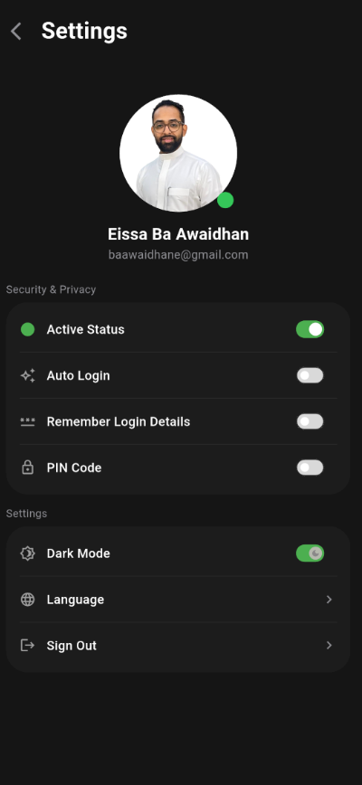
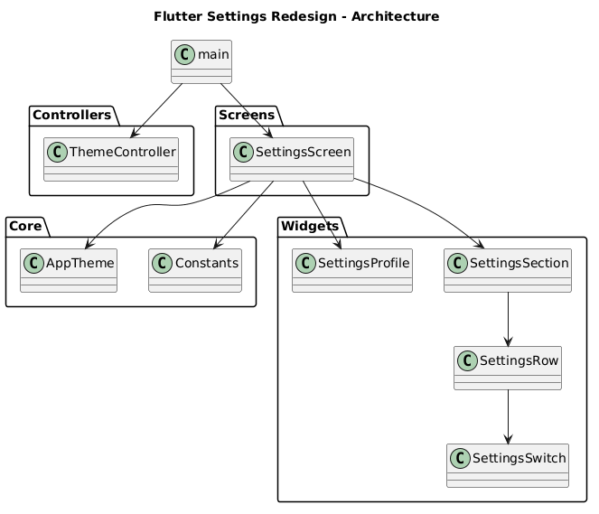

# Flutter Settings Redesign

A clean and modern Flutter Settings screen redesign that showcases custom UI components, light/dark theme support, and a simple, reusable architecture using GetX for theme management.

---

## 📸 Screenshots

### Before (Inspiration)

> Original settings screen inspiration used as a starting point for this redesign.



### After

**Light mode**



**Dark mode**



---

## 🧱 Features

- Modern settings screen UI inspired by real-world mobile apps.
- Full light/dark theme support using `ThemeData` and `ColorScheme`.
- Reusable widgets:
  - `SettingsSection` for grouping related options inside cards.
  - `SettingsRow` for individual items (icon, title, trailing widget).
  - `SettingsProfile` for the profile/header section.
  - `SettingsSwitch` for toggle controls.
- Centralized theming in `AppTheme` and runtime theme switching with GetX `ThemeController`.
- Clean, easy-to-read folder structure that can be plugged into real projects.

---

## 🗺️ Architecture

High-level view of how the app is structured:



---

## 📂 Project Structure

```text
lib/
  core/
    app_theme.dart        // Light & dark ThemeData definitions
    constants.dart        // Shared colors, app name, etc.
  controllers/
    theme_controller.dart // GetX controller for ThemeMode
  screens/
    settings_screen.dart  // Main Settings UI
  widgets/
    settings_profile.dart // Profile header widget
    settings_row.dart     // Single settings row (icon, title, trailing)
    settings_section.dart // Card-like section for grouping rows
    settings_switch.dart  // Custom switch wrapper
  main.dart               // App entry point (GetMaterialApp + theming)
```

---

## 🛠 Tech Stack

<p>
  
  
  
</p>

---

## 🤝 Credits

- Frontend & UI/UX: [Eissa Ba Awaidhan](https://github.com/Eissa2123)
  Portfolio: https://eissa-portfolio.vercel.app/


---

## 🚀 Getting Started

1. Clone the repository:

```bash
git clone https://github.com/Eissa2123/flutter-settings-redesign.git
cd flutter-settings_redesign
```

2. Install dependencies:

```bash
flutter pub get
```

3. Run the app:

```bash
flutter run
```

---

## 💡 Notes

- This project is mainly focused on UI/UX and theming, but the structure is ready to be integrated into larger production apps.
- Feel free to fork, extend, or reuse the `SettingsSection` / `SettingsRow` widgets in your own projects.